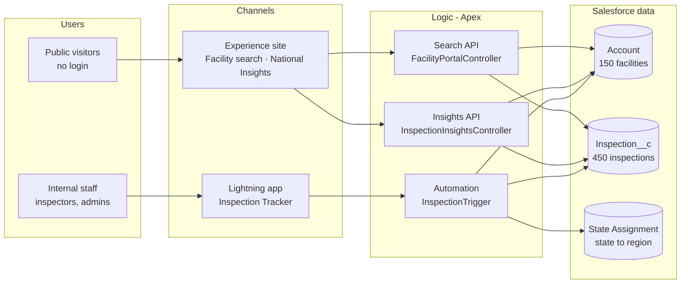

# Medical Facility Inspection Tracker — Project Documentation

Oct 8, 2026 · Punit Singh

## Project overview

A working Salesforce application, built in one Claude Code session, that tracks yearly inspections of US medical facilities and publishes the results on a public website. It was built as a Forward Deployed Engineer (FDE) exercise: take a business need, design the solution with the stakeholder, and ship it to a real org.

**The problem.** Every licensed medical facility must be inspected once a year. Regulators need to schedule and assign those inspections, and the public needs a simple way to check whether a facility passed.

**What was built**

| Part | Who uses it | What it does |
| --- | --- | --- |
| Inspection Tracker app | Inspectors and program admins | Facilities (Accounts), inspections, 6 reports and an Inspection Compliance dashboard |
| Automation | Runs on every save | Assigns an inspector by state, schedules the next inspection (+365 days on a pass, +30 days on a failure), keeps each facility's status current |
| Facility search portal | Anyone, no login | Search by name, city or ZIP; filter by state, status and type; a US map with status-colored markers; inspection history |
| National Insights page | Anyone, no login | KPIs, a 50-state compliance map, quarterly result trends, most-cited deficiencies, facility type and region comparisons |

**Where it lives**

- Facility search: [orgfarm-24624b149c-dev-ed.develop.my.site.com/inspections](https://orgfarm-24624b149c-dev-ed.develop.my.site.com/inspections)
- National Insights: [orgfarm-24624b149c-dev-ed.develop.my.site.com/inspections/insights](https://orgfarm-24624b149c-dev-ed.develop.my.site.com/inspections/insights)
- Source code (public): [github.com/psiforce/inspection-tracker](https://github.com/psiforce/inspection-tracker)
- Full technical design: [Solution Architecture](Solution-Architecture.md) in this repository

**By the numbers:** 41 Apex tests passing, 94% code coverage, 150 demo facilities across all 50 states.

## Architecture at a glance

**Guest security on every public request:** the sharing rule exposes only facilities marked Publicly Listed; the guest permission set grants public fields only; all queries run `with sharing` in `USER_MODE`; and responses never include inspector names or internal notes.

Public visitors reach the data only through the two read-only APIs, under the guest security rules. Staff work in the Lightning app, and every save runs the trigger that assigns, rolls up and schedules. Built with Salesforce metadata, Apex, Lightning Web Components and an LWR Experience Cloud site; the charts are hand-built SVG with no third-party library.

## Datasets used

All data is synthetic. A deterministic Apex generator (`InspectionSampleData`) creates it, so every run produces the same 150 facilities and 450 inspections. No real facility, patient or inspector data was used.

| Dataset | Records | Source | Key fields |
| --- | --- | --- | --- |
| Medical facilities (Account, record type Medical Facility) | 150 (3 per state × 50 states) | Generated; real US city coordinates and ZIP codes | Name, facility type, license number, address, latitude/longitude, region, publicly listed |
| Inspections (`Inspection__c`) | 450 (300 completed, 150 open) | Generated, with 1–3 years of history per facility | Type, status, scheduled and completed dates, score (0–100), public summary, internal notes, deficiency areas |
| State assignments (`State_Assignment__mdt`) | 50 | Hand-built reference data | State code and name, region (5 regions), inspector username |

**How the generator shapes the data**

- **Facility types:** about 25% hospitals, 25% clinics, 20% urgent care, 15% nursing homes, 8% laboratories, 7% surgery centers.
- **Scenarios per facility:** about 6% new (no inspection yet), 10% overdue, 8% recently failed, 10% passed with conditions, the rest passed.
- **Scores:** passed 88–100, passed with conditions 72–87, failed 40–69.
- **Deficiency areas:** 8 areas (for example infection control and medication storage), cited on every conditional or failed result, sometimes two per inspection.

The result is 93 facilities passed, 16 passed with conditions, 18 failed, 11 overdue and 12 scheduled. Because the data is generated, the trends on the Insights page are illustrative; they show what the dashboards surface, not real-world findings.

To use real data, load a CSV such as CMS provider data with Data Loader, upserting on `License_Number__c`.

## Prompts used during vibe coding

The whole project took 13 prompts, plus answers to 14 multiple-choice questions Claude asked along the way. The prompts are quoted as typed, in order.

| # | Prompt | What it produced |
| --- | --- | --- |
| 1 | “As part of creating project for FDE (forward deployed engineer), I want to create a project for tracking yearly inspections of medical facilities. I want to create it in salesforce. There has to be a portal (experience cloud) for anyone to see/track the status of inspection of medical facilities where they can search and see medical facilities on a US map. Ask me questions to create this project in salesforce.” | Three rounds of planning questions (below), then a written build plan |
| 2 | “Add process flow diagram and system landscape diagram to the plan. Also add solution architecture documentation.” | Mermaid diagrams in the plan, and a solution architecture document added as a deliverable |
| 3 | “Can you make the diagrams in visual format so that I can see it visually?” | A published page with the rendered diagrams |
| 4 | (Plan approved) | All metadata, Apex, LWCs, tests and docs written; lint and format checks run locally |
| 5 | “Unexpected token 'sf' in expression or statement…” (pasted error) | Diagnosis: the `!` prefix doesn't work in PowerShell; Claude started the org login itself |
| 6 | “done...deploy the project now” | Three deploy rounds, four test fixes, demo data loaded, Experience Cloud site created and published |
| 7 | “upload this codebase to github” | Local git repository and first commit; GitHub CLI installed |
| 8 | “gh : The term 'gh' is not recognized…” (pasted error) | Workaround: run `gh` by its full path until VS Code restarts |
| 9 | “public”, then “done” | Secrets scan, then the public repository created and pushed |
| 10 | “I want to add dashboards to the public portal (experience cloud). Suggest dashboards that can provide useful insights into inspection trends across entire US. Also suggest top 3 useful insights from the data.” | Data analysis, 4 dashboard proposals, top 3 insights, a plan, then the National Insights page |
| 11 | “check all into github” | Confirmed everything was already committed and pushed |
| 12 | “create project documentation…” | This document |
| 13 | “check in everything to github” | This document added to the repository |

**Decisions made through Claude's questions** (multiple-choice, with a recommended option marked):

| Topic | Choice |
| --- | --- |
| Target org | Developer Edition org |
| Portal access | Public, no login (guest user) |
| Map | Custom LWC with the built-in `lightning-map` |
| Data | Generated sample data, about 150 facilities |
| Data model | Account for facilities + custom `Inspection__c` |
| Statuses | Standard lifecycle, with Overdue after 365 days |
| Automation | Auto-schedule next inspection, inspector assignment by region, internal reports and dashboard |
| Search filters | Name/city/ZIP text, state, status, facility type |
| Inspectors | Salesforce Users mapped by custom metadata |
| Facility detail | Status plus inspection history |
| Extras | Apex unit tests |
| Enable Digital Experiences | Yes (permanent setting) |
| Dashboards | All four: KPIs + state map, trend, deficiencies, type and region comparison |
| Dashboard placement and charts | New `/insights` page, hand-built SVG charts |

## Iterations tried

Code that looked right locally needed 3 deploy rounds and 3 test rounds before the org accepted it. Every failure below was found by the real platform, not by local checks, and each fix is in the repository.

**Planning: 2 rounds of plan revision before any code**

1. The first plan covered the data model, Apex, LWCs, site and verification.
2. It was sent back twice for more: first process-flow and system-landscape diagrams plus a solution architecture deliverable, then a rendered visual version of the diagrams.

**Deploy: 13 errors on the first attempt, 0 on the third**

| Round | What failed | Fix |
| --- | --- | --- |
| 1 | Admin profile had no default record type | Made Medical Facility the default for admins |
| 1 | Apex loop over `Database.queryWithBinds` needed an explicit cast | Cast the result to `List<Account>` first |
| 1 | App XML had elements in an unsupported order | Removed the optional navigation flags |
| 1 | Reports filtered on `CreatedDate`, which wasn't in the report type | Added the field to both report types |
| 1 | Admin permission set had View All on inspections without View All on accounts | Removed View All / Modify All |
| 1 | List view used `$User.Id`, which only mobile filters allow | Replaced with an Open Inspections view |
| 1 | Dashboard metric settings conflicted with auto-selected columns | Set columns explicitly |
| 2 | Dashboard donut had the same conflict | Turned off auto-select on every component |
| 1–2 | 5 more errors that cascaded from the ones above | Cleared once their causes were fixed |

**Tests: 4 of 21 failing, then 2, then 0**

| Failure | Root cause | Fix |
| --- | --- | --- |
| “Please select a state from the list of valid states” | The org has State and Country picklists on, so `TX` and `Guam` were rejected | Tests use full state names; one test uses a facility with no state |
| “Script-thrown exception” instead of the message | `AuraHandledException` hides its message unless `setMessage` is also called | A helper that sets both |
| “Fields being inaccessible on Inspection__c” | The update re-sent the master-detail field; this only fails inside tests. Found with a temporary diagnostic test that printed the failing field | Tests update only the fields that change |

**Experience Cloud site: 5 steps, all done from the command line**

1. Site creation failed until Digital Experiences was turned on, which needed explicit approval because it's permanent.
2. The site was created, then its metadata retrieved into the project.
3. The portal component was placed on the home page, public access turned on and the site set to Live, all by editing the retrieved files.
4. The guest sharing rule was rejected for including account settings, which guest rules don't allow; it deployed once those were removed.
5. A guest call to the live API returned 150 facilities with no internal fields.

**Dashboards: 2 design corrections before code**

- **Platform limit:** standard Salesforce dashboards can't be shown to guest users, so the portal dashboards became custom LWCs with an aggregate-only Apex endpoint.
- **Accessibility:** the existing pass/conditional/fail colors failed a color-blindness check (two colors too close). The charts use an adjusted, validated set with legends and screen-reader tables.

The first deploy of the dashboards failed because two new Apex classes were missing their metadata files; it passed once they were added.

## Learnings and observations

The biggest lesson: AI-assisted coding gets to a working prototype fast, but a production-grade application still takes several iterations and ordinary software engineering discipline.

**What worked well**

- **Planning mode organizes the thinking.** Claude asked structured questions before writing code, each with a recommended option. That turned a one-paragraph idea into about 15 concrete decisions in minutes, and the written plan could be reviewed, sent back and improved before any code existed.
- **Feedback goes in at the cheapest point.** Rejecting the plan to add diagrams and an architecture document cost one revision. The same change after the build would have meant rework.
- **Visual artifacts beat text.** Mermaid source in a plan is hard to review; a rendered page of the same diagrams made the design easy to check.
- **Claude asked before irreversible steps.** It paused to confirm turning on Digital Experiences (permanent), checked the repository for secrets before making it public, and flagged the Salesforce username in the site files.
- **Verification against the real system.** Claude didn't stop at “it compiles.” It called the live guest API to prove the public sees 150 facilities and no internal fields.

**What took effort**

- **Multiple iterations are normal.** 13 deploy errors, then 4 failing tests, then 2. Local lint and formatting passed throughout; only the real org exposed the problems.
- **Platform knowledge is the hard part.** Most failures were Salesforce-specific rules: metadata element order, State and Country picklists, guest-user limits, `AuraHandledException` behavior, master-detail fields in tests. These are what an experienced Salesforce engineer knows and a generic code generator doesn't.
- **Production grade means engineering, not just code.** Security (`with sharing`, user-mode queries, field-level security, DTOs that strip internal fields), bulk-safe triggers, idempotent automation, 94% test coverage, accessibility and documentation all had to be asked for or designed in deliberately.
- **Environment friction is real.** The `!` shell prefix, a VS Code PATH that hadn't refreshed after installing `gh`, a login that timed out, and a file stuck by OneDrive each cost a round trip.
- **Some things can't be verified by the agent.** Claude confirmed the APIs and page responses, but couldn't see the portal render in a browser. A human still has to look.

**Observations for future FDE work**

1. Start in planning mode, and use the questions to drive the stakeholder conversation.
2. Ask for diagrams and an architecture document up front; they double as the review artifact.
3. Connect a real org early, and deploy small pieces often rather than everything at once.
4. Treat the agent like a fast junior engineer: give clear requirements, review its plan, and insist on tests and verification.

## Next steps

- [ ] Open both portal pages in an incognito browser and confirm the map and charts render, including at phone width
- [ ] Replace the Salesforce username in the site metadata with a placeholder before sharing the repository widely
- [ ] Load real facility data (for example CMS provider data) and re-check the Insights findings
- [ ] Add LWC Jest tests for the portal and chart components
- [ ] Add a scheduled overdue alert to inspectors, and marker clustering if the facility count grows past about 500
- [ ] Run an accessibility audit against WCAG 2.1 AA
