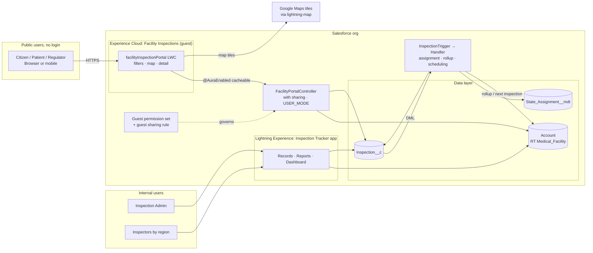
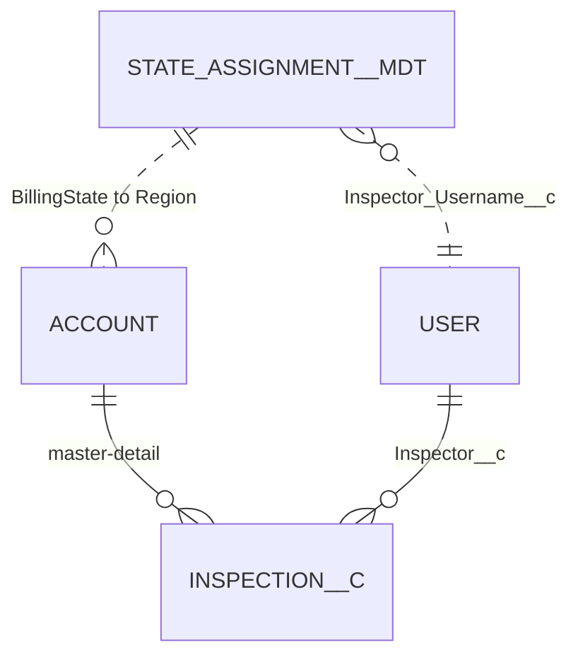
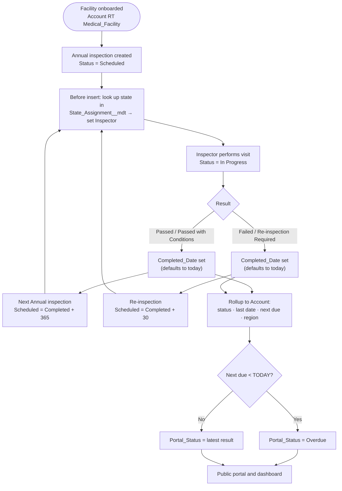
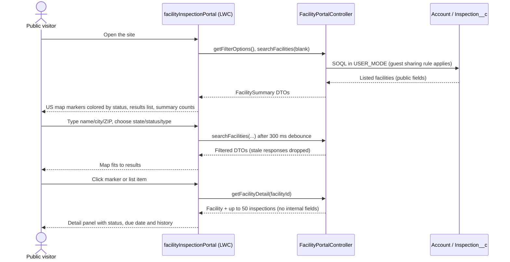

# Medical Facility Inspection Tracker: Solution Architecture

Rendered diagrams: https://claude.ai/artifact/Y4DEa7Jbd67AyGevjzyBhV

## 1. Executive summary

State health programs must inspect every licensed medical facility once a year. This solution tracks those inspections in Salesforce and publishes the results on a public Experience Cloud portal. Anyone can open the portal without logging in, search for a facility, find it on a US map, and see its current status and inspection history.

Internally, inspectors and program administrators use the **Inspection Tracker** Lightning app. When an inspection is completed, the next one is scheduled automatically and assigned to the right inspector for that state. A compliance dashboard shows overdue and failing facilities across all regions.

| Audience | Channel | What they do |
| --- | --- | --- |
| Public (patients, families, regulators, press) | Experience Cloud site, guest access | Search, filter, view map, read status and history |
| Inspectors | Lightning app | Work their open inspections and record results |
| Program administrators | Lightning app, reports, dashboard | Manage facilities and assignments, monitor compliance |

## 2. Requirements

**Functional**

1. Store facilities with type, license number, address and coordinates.
2. Record inspections: type, scheduled and completed dates, result, score, public summary, internal notes.
3. When an inspection passes, schedule the next annual inspection 365 days later. When it fails, schedule a re-inspection 30 days later.
4. Assign new inspections to an inspector by facility state.
5. Mark a facility **Overdue** once its next inspection due date has passed.
6. Public portal: search by name, city or ZIP; filter by state, status and facility type; US map with status-colored markers; facility detail with inspection history.
7. Internal reports and a compliance dashboard.

**Non-functional**

| Concern | Target |
| --- | --- |
| Public access | Read-only, no login, and no internal data (inspector, internal notes) exposed |
| Performance | Search returns in under 2 s for 500 facilities (capped at 500 results) |
| Devices | Responsive layout from 360 px phones to desktop |
| Maintainability | Region and inspector mapping changeable without code (custom metadata) |
| Quality | Apex test coverage ≥ 75% (target 85%+); bulk-safe for 200-record batches |

## 3. System landscape

### Component inventory

| Metadata type | Name | Purpose |
| --- | --- | --- |
| Record type | `Account.Medical_Facility` | Marks an Account as an inspected facility |
| Custom object | `Inspection__c` | One inspection (master-detail to Account) |
| Global value set | `Inspection_Status` | Shared status values for Inspection and Account |
| Custom metadata type | `State_Assignment__mdt` (50 records) | State → region → inspector username |
| Apex trigger | `InspectionTrigger` | Single trigger, delegates to the handler |
| Apex class | `InspectionTriggerHandler` | Routes trigger events; `bypass` switch |
| Apex class | `InspectorAssignmentService` | Sets `Inspector__c` on new inspections |
| Apex class | `FacilityRollupService` | Rolls inspection results up to the facility |
| Apex class | `InspectionSchedulingService` | Creates the follow-up inspection |
| Apex class | `StateAssignments` | Cached lookup of state assignments by code or name |
| Apex class | `FacilityPortalController` | Read-only API for the portal; returns DTOs |
| Apex class | `InspectionInsightsController` | Read-only national statistics for the Insights page (aggregates only) |
| Apex class | `InspectionSampleData` | Seeds 150 demo facilities |
| LWC | `facilityInspectionPortal` | Portal page: header, filters, stats, map, results and detail |
| LWC | `facilitySearchFilters`, `facilityMap`, `facilityDetail` | Child components |
| LWC | `inspectionInsights` | National Insights page: KPIs, key findings, state map, trend, deficiencies, comparisons |
| LWC | `insightsKpiTiles`, `usStateTileMap`, `insightsTrendChart`, `insightsBarChart` | Hand-built SVG/CSS charts (no chart library) |
| LWC modules | `inspectionStatus` (JS), `portalStyles` (CSS) | Shared status colors, formatting and pill styles |
| Permission sets | `Inspection_Portal_Guest`, `Inspector`, `Inspection_Tracker_Admin` | Access model |
| Guest sharing rule | `Account.Public_Medical_Facilities` | Guest read on listed facilities (`site-config/`) |
| App | `Inspection_Tracker` | Internal Lightning app |
| Report types | `Medical_Facilities`, `Facilities_with_Inspections` | Reporting |
| Reports and dashboard | 6 reports in *Inspection Reports*; *Inspection Compliance* dashboard | Monitoring |

## 4. Data model

### Field dictionary

**Account (record type Medical_Facility)**

| API name | Type | Visibility | Source of value |
| --- | --- | --- | --- |
| `Name` | Text | Public | User |
| `Facility_Type__c` | Picklist (Hospital, Urgent Care, Clinic, Nursing Home, Laboratory, Surgery Center) | Public | User |
| `License_Number__c` | Text(30), unique, external ID | Public | User / data load |
| `Billing*` address, `BillingLatitude/Longitude` | Address | Public | User / data load |
| `Region__c` | Picklist (Northeast, Southeast, Midwest, Southwest, West) | Public | Rollup from `State_Assignment__mdt` when blank |
| `Publicly_Listed__c` | Checkbox (default true) | Internal control | User; drives the guest sharing rule |
| `Inspection_Status__c` | Picklist (global value set) | Public | Rollup: latest completed result |
| `Last_Inspection_Date__c` | Date | Public | Rollup |
| `Next_Inspection_Due__c` | Date | Public | Rollup: earliest open inspection, else last + 365 |
| `Portal_Status__c` | Formula (Text) | Public | `Overdue` if next due < today; `Not Yet Inspected` if no status; else the status |

**Inspection__c** (auto-number `INS-000000`)

| API name | Type | Visibility | Notes |
| --- | --- | --- | --- |
| `Facility__c` | Master-detail (Account) | Public | Sharing is controlled by the parent |
| `Inspection_Type__c` | Picklist (Annual, Re-inspection, Complaint) | Public | |
| `Status__c` | Picklist (global value set) | Public | |
| `Scheduled_Date__c` | Date | Public | Required (validation rule) |
| `Completed_Date__c` | Date | Public | Defaults to today when a result is set |
| `Score__c` | Number(3,0) | Public | Validated to 0–100 |
| `Public_Summary__c` | Long text | Public | Shown on the portal |
| `Deficiency_Areas__c` | Multi-select picklist (8 areas) | Public | Areas cited; aggregated on the Insights page |
| `Inspector__c` | Lookup (User) | **Internal** | Auto-assigned |
| `Internal_Notes__c` | Long text | **Internal** | Never queried by the portal |

### Status definitions

| Status | Meaning | Open or completed |
| --- | --- | --- |
| Scheduled | Inspection is on the calendar | Open |
| In Progress | Inspector is on site or writing up | Open |
| Passed | No deficiencies | Completed (passing) |
| Passed with Conditions | Minor deficiencies; plan of correction accepted | Completed (passing) |
| Failed | Significant deficiencies | Completed (failing) |
| Re-inspection Required | Must be re-inspected before it can pass | Completed (failing) |
| *Overdue* (portal only) | Next due date has passed | Derived |
| *Not Yet Inspected* (portal only) | No inspections on record | Derived |

## 5. Process flows

### Yearly inspection lifecycle

### Public portal search

### Inspector assignment

1. On `before insert`, `InspectorAssignmentService` collects inspections that have no `Inspector__c`.
2. It reads each facility's `BillingState` and looks it up in `State_Assignment__mdt`. Both the code (`TX`) and the full name (`Texas`) match, so it works whether or not State and Country picklists are on.
3. It resolves `Inspector_Username__c` to an active User in one query.
4. If there is no row, no username, or the user is inactive, the facility owner gets the inspection, so new inspections are never left unassigned.

## 6. National Insights (public dashboards)

Salesforce report dashboards can't be shown to guest users, so the portal's **/insights** page is built from custom LWCs and one read-only Apex endpoint, `InspectionInsightsController.getNationalInsights(facilityType)`.

| Panel | What it shows | Data |
| --- | --- | --- |
| KPI tiles | % compliant, overdue, failing, 12-month fail rate, 12-month average score, due in 90 days | Facilities + completed inspections |
| Key findings | Three sentences computed from the data: fail-rate change this year vs last, top deficiency area, overdue concentration | Derived on the client |
| Compliance by state | 50-state tile map shaded by % compliant (sequential blue, 4 bins + "no facilities"); each tile links to `/?state=<name>` on the search page | Facilities by `BillingState` |
| States needing attention | Up to 8 states with the most overdue or failing facilities | Same |
| Results over time | 12 quarters of stacked results (Passed / Passed with conditions / Failed), with a separate average-score panel on the same quarters (no dual axis) | Completed inspections |
| Most-cited deficiency areas | Citations per area, last 24 months | `Deficiency_Areas__c` |
| How long facilities are overdue | 1–30, 31–90 and over 90 days | `Next_Inspection_Due__c` |
| Compare types and regions | Fail rate, overdue share or average score by facility type and region (toggle) | Both |

**Design notes**
- The response contains only aggregates: no record IDs, inspector names or internal notes. Queries run in `USER_MODE` under the same guest sharing rule and permission set as the search API, so unlisted facilities are never counted.
- Aggregation happens in Apex loops, because `Portal_Status__c` is a formula and can't be grouped in SOQL. Input is capped at 10,000 facilities and 20,000 inspections. The method is `cacheable=true`.
- Charts follow the data-visualization checks: the result colors were validated for color-vision deficiency; there are legends, direct labels and hover/focus tooltips; and every chart has a screen-reader data table.

**Top insights from the demo data** (illustrative, because the data is generated):
1. The fail rate rose from 9.2% (2025) to 16.8% (2026 so far), and the average score fell from 88.1 to 85.7.
2. Infection control is the most-cited deficiency area, followed by patient-records privacy and emergency preparedness.
3. 11 facilities (7.3%) are overdue, 3 of them by more than 90 days. Hospitals and clinics run about 11% overdue, versus 0% for urgent care. Wyoming has all 3 of its facilities overdue or failing.

## 7. Security architecture

The guest user is the main risk, so it is restricted in several separate ways:

| Layer | Control |
| --- | --- |
| Org-wide defaults | External access is Private for Account; Inspection__c is Controlled by Parent |
| Record access | Guest sharing rule `Public_Medical_Facilities`: read where `Publicly_Listed__c = true`. Inspections inherit it through master-detail |
| Object and field access | `Inspection_Portal_Guest` permission set: read only, public fields only. No `Inspector__c`, no `Internal_Notes__c` |
| Apex | `FacilityPortalController` is `with sharing`, and every query runs in `USER_MODE`, so the platform enforces CRUD, FLS and sharing |
| API surface | Three read-only `@AuraEnabled(cacheable=true)` methods. No DML is exposed to guests |
| Data shape | DTOs carry only public fields, so internal fields can't leak even if someone later adds them to a query by mistake |
| Input handling | All SOQL uses bind variables; LIKE wildcards are escaped; the search term is capped at 80 characters; results are capped at 500 |
| Errors | Query failures are logged and come back as a generic message, with no stack traces |

**Permission matrix**

| Permission | Guest | Inspector | Admin |
| --- | --- | --- | --- |
| Account | Read | Read | Read, Create, Edit |
| Inspection__c | Read | Read, Create, Edit | Full + View/Modify All |
| `Inspector__c`, `Internal_Notes__c` | None | Read/Edit | Read/Edit |
| Inspection Tracker app | None | Visible | Visible |
| `FacilityPortalController` | Yes | Yes | Yes |
| `InspectionSampleData` | None | None | Yes |

The automation services (`InspectorAssignmentService`, `FacilityRollupService`, `InspectionSchedulingService`) run `without sharing`. An inspector who completes an inspection must still be able to update the facility rollup and create the follow-up, even without edit access to the Account. They only run from the trigger and expose nothing to the portal.

Guest-site limits to keep in mind: the portal is cached (`cacheable=true`), and Salesforce rate-limits guest requests per site, which is enough for a public lookup tool.

## 8. Integration and extensibility

- **Maps:** `lightning-map` renders Google Maps tiles through Salesforce's own proxy, with no API key or CSP entry. Markers use SVG `mapIcon` paths colored by status.
- **Real facility data:** load a CSV (for example CMS Provider of Services data) with Data Loader, upserting on `License_Number__c`. If the rows lack coordinates, turn on the Geocodes for Account Billing Address data integration rule.
- **Notifications:** a Platform Event (`Inspection_Status_Changed__e`) published from the handler could feed email alerts or an external regulator system.
- **Overdue alerts:** a scheduled flow that queries `Portal_Status__c = 'Overdue'` can notify inspectors weekly.
- **Region changes:** edit the `State_Assignment__mdt` records in Setup. No deploy is needed.

## 9. Automation design

- **One trigger per object:** `InspectionTrigger` delegates to `InspectionTriggerHandler`, which uses `switch on Trigger.operationType`.
- **Bulk-safe:** each service runs a fixed number of queries per batch, no matter how many records are in it (assignment: 2, rollup: 1 + 1 DML, scheduling: 1 + 1 DML).
- **Idempotent scheduling:** a follow-up is created only if the facility has no open inspection, and only one per facility per batch, based on its latest result. Historical loads and reruns don't create duplicates.
- **Recursion guard:** `InspectionSchedulingService` tracks processed IDs in a static set. The rollup only updates Accounts whose values actually changed.
- **Bypass:** `InspectionTriggerHandler.bypass = true` turns automation off for special data loads.
- **Why Apex rather than Flow:** the logic crosses records (latest result per facility, an open-inspection check, bulk dedupe), which is easier to test in Apex, and it counts toward deployable code coverage. A Flow would work for simpler variations.

## 10. Deployment and environment

Target: a Salesforce Developer Edition org. See [README](../README.md#setup) for the commands.

1. Deploy `force-app` (objects, Apex, LWC, permission sets, app, reports, dashboard).
2. Assign `Inspection_Tracker_Admin` to yourself and run the Apex tests.
3. Seed data with `scripts/apex/seedData.apex`.
4. Create the Experience Cloud site *Facility Inspections*, add `facilityInspectionPortal` to the Home page, allow guest access, and publish.
5. Assign `Inspection_Portal_Guest` to the site guest user, then deploy `site-config` (the guest sharing rule).
6. Optionally put real inspector usernames into `State_Assignment__mdt`.

## 11. Testing strategy

| Test class | Covers |
| --- | --- |
| `InspectionTriggerHandlerTest` | Pass → +365 annual; fail → +30 re-inspection; no duplicate when an open inspection exists; overdue formula; delete and undelete rollup; 150-record bulk insert; bypass |
| `InspectorAssignmentServiceTest` | Owner fallback; user-selected inspector kept; unknown state; code/name lookup |
| `FacilityPortalControllerTest` | Runs as a user with only the guest permission set: unlisted facilities hidden; text/state/status/type filters; literal `%`; no internal fields in serialized JSON; friendly error when access is missing; filter options |
| `InspectionInsightsControllerTest` | Runs as a guest-equivalent user: KPI math, all 50 states, quarter bucketing, multi-select deficiency counts, overdue aging, facility-type filter, unlisted facilities excluded, no IDs or internal fields in the JSON |
| `InspectionSampleDataTest` | Generator creates facilities with exactly one open inspection each, and reruns cleanly |

**Manual guest checklist** (in an incognito window):
- The map shows about 150 markers, and the colors match the legend.
- Each filter narrows both the list and the map; *Clear filters* restores everything.
- Clicking a marker opens the detail panel with its history.
- The browser network tab shows no `Inspector` or `Internal_Notes` values in any response.
- Unchecking *Publicly Listed* on a facility removes it from the portal.

## 12. Design decisions

| Decision | Chosen | Alternative | Why |
| --- | --- | --- | --- |
| Facility model | Account + record type | Custom `Medical_Facility__c` object | Standard address and geolocation, Account reporting and future relationships (contacts, cases) |
| Portal template | Build Your Own (LWR) | Aura template | Faster page loads and the current Salesforce direction. The LWC works in both, so falling back costs nothing |
| Map | `lightning-map` | Leaflet + OpenStreetMap | No third-party library, CSP setup or API key; enough for status markers |
| Assignment config | Custom metadata | Queues per region | Deployable, versioned, editable in Setup, and reads don't count against SOQL limits |
| Overdue status | Formula field | Nightly batch job | Always current with no scheduled job; filterable in SOQL and reports |
| Guest data access | Sharing rule + USER_MODE | `without sharing` controller | Uses platform enforcement instead of hand-written checks |

## 13. Risks and future enhancements

| Risk | Mitigation |
| --- | --- |
| `lightning-map` behaves differently in LWR sites | Verify after publishing; if needed, switch the site to the Aura Build Your Own template (no code change) |
| Guest sharing rule names the site by API name | Check the site's API name after creating it and update `site-config` if it differs |
| More than 500 facilities | Add server-side paging and marker clustering (Leaflet), or summarize by state at low zoom |
| Formula `TODAY()` isn't indexed | Fine at this scale; at larger volume, maintain an `Is_Overdue__c` checkbox with a nightly batch job |

Future work: multilingual portal (Spanish first), accessibility audit to WCAG 2.1 AA, facility-submitted plans of correction through authenticated login, and a public CSV download of the results.
